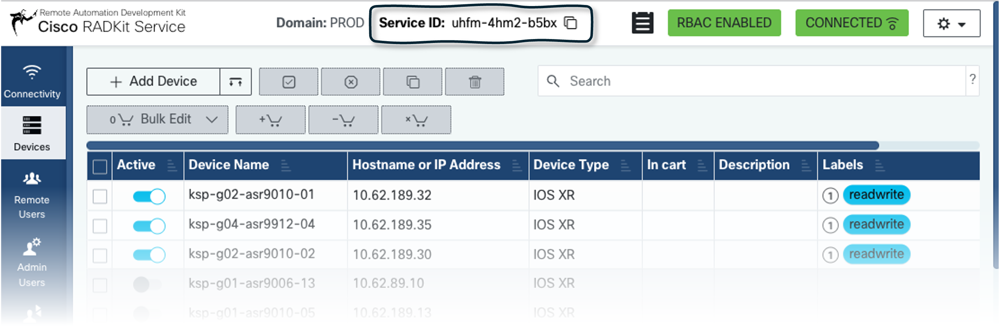
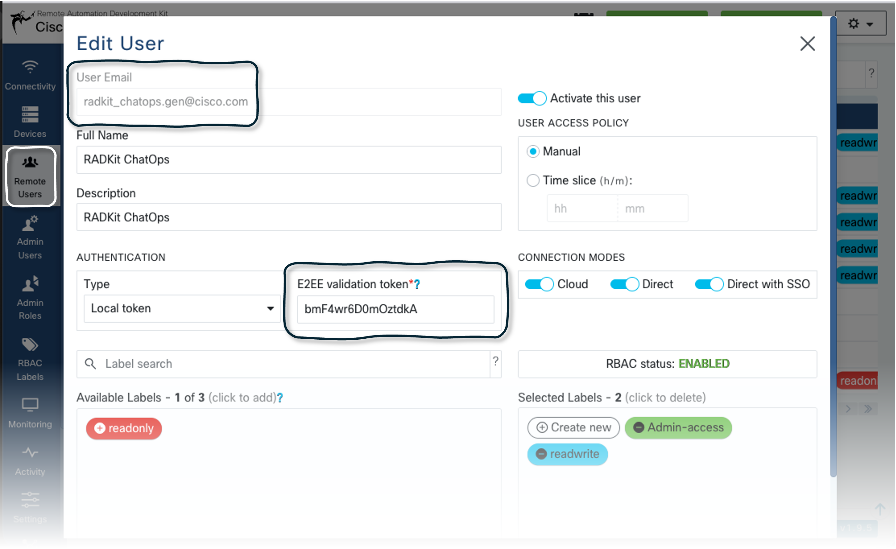

# ⚙️ General setup
## 🛠️ Your environment setup for running Jupyter notebooks
  

Follow the steps below to create an isolated Python virtual environment, install the required dependencies, and register the kernel so you can run this notebook.

### 1. Install uv

`uv` is a fast Python package and project manager. Install it once on your machine:

| Platform | Command |
|----------|---------|
| 🍎🐧 macOS / Linux | `curl -LsSf https://astral.sh/uv/install.sh \| sh` |
| 🪟 Windows (PowerShell) | `powershell -ExecutionPolicy ByPass -c "irm https://astral.sh/uv/install.ps1 \| iex"` |

Or via Homebrew on macOS:
```bash
brew install uv
```

Verify the installation:
```bash
uv --version
```

### 2. Create the virtual environment and install all dependencies

From the project root, run:

```bash
uv sync
```

Then finally, select **radkit-notebooks (3.13+)** as the kernel for this notebook in your IDE (see the links below):

---

### 🔗 How to select the kernel in your IDE

- **VS Code** — [Select a Jupyter kernel in VS Code](https://code.visualstudio.com/docs/datascience/jupyter-kernel-management)
- **JupyterLab / Classic Notebook** — [Change the kernel in JupyterLab](https://jupyterlab.readthedocs.io/en/stable/user/running.html)
- **PyCharm** — [Configure a Jupyter kernel in PyCharm](https://www.jetbrains.com/help/pycharm/jupyter-notebook-support.html)
- **DataSpell** — [Manage Jupyter kernels in DataSpell](https://www.jetbrains.com/help/dataspell/jupyter-notebook-support.html)

---

## 👁️ Naming conventions and where to find things in your RADKit
### Service code
When the notebooks talk about your service code, you need to provide the code located in the upper part of your RADKit web portal.

<div style="align:center">
  
</div>

### Remote User (username/password)
You must need to have at least one enabled remote user. Navigate to the section in the left menu and locate the details of your target user.

<div style="align:center">
  
</div>

---

</br>

`Now you're all set! 🚀`